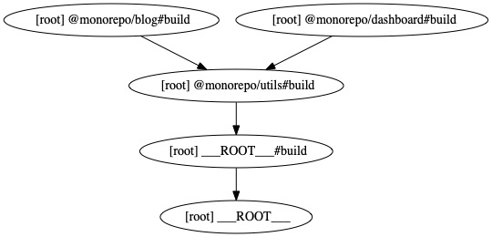

# Monorepos with Turborepo and NPM Workspaces

## Lessons

### Lesson 01 - Installing Turborepo in an existing project

1. We need to install Turborepo in our project by running `npm install turbo -D` to install it in the root of our project as a `devDependency`.
2. Then, we need to update `.gitignore` to prevent `git` to include certain folders in version control. In this case, we're going to ignore `.turbo` and the output folders for all the applications in the monorepo, `dist/**` and `.next/**`
3. Create a `turbo.json` file and reference the Turborepo's JSON Schema

### Lesson 02 - Create your first turborepo pipeline

1. Let's add the `pipeline` object in the `turbo.json` file.
2. Select the scripts we want Turborepo to take care of from our `package.json` file, then. For instance, if we want Turborepo to run the `dev` command, we have to create a `"dev"` key inside the `"pipeline"` object in `turbo.json`.
3. We can try this out with the Turborepo CLI, we just need to run `npx turbo run [your pipeline name]`
4. Make sure we add the `@monorepo/utils` package as a dependency in the `@monorepo/blog` and `@monorepo/dashboard` projects to avoid any dependency problems. For this we can use the command `npm install @monorepo/utils -w=@monorepo/blog -w=@monorepo/dashboard`. For more information, see this Egghead.io lesson [Install dependencies for specific packages in a monorepo](https://egghead.io/lessons/npm-install-dependencies-for-specific-packages-in-a-monorepo)
5. We migrate all the commands that we care about as Turborepo pipelines.

- [x] `dev` -> `npx turbo run dev`
- [x] `check` -> `npx turbo run test typecheck`
- [x] `test` -> `npx turbo run test`
- [x] `build` -> `npx turbo run build`
- [x] `typecheck` -> `npx turbo run typecheck`

6. Let's replace all the scripts we have in the root `package.json` with their turborepo counterparts.

### Lesson 03 - Pipeline dependencies

In some cases, you want to make sure that Turborepo is building the dependencies in a specific order, for example, we always want to build the `@monorepo/utils` first, before building the `@monorepo/dashboard` and `@monorepo/blog` projects. For that, we have to add the `"dependsOn"` key to the pipeline we want to behave like that.

```diff
  "build": {
+   "dependsOn": ["^build"],
    "outputs": [".next/**", "dist/**"]
  },
```

In some other cases where you need more granular control over what to build first in different projects you can do the following:

#### 🚨This is a contrived example🚨

Turborepo is already taking care of building things in the right order because `@monorep/utils` is a dependency of `@monorepo/dashboard` and `@monorepo/blog` and that we're already specifying that `@monorepo/dashboard` and `@monorepo/blog` depend on the build step from `@monorepo/utils` to succeed. All that said, for this lesson we're going to remove the `@monorepo/utils` dependencies from `@monorepo/dashboard` and `@monorepo/blog`, then we delete the build artifacts from `@monorepo/utils` (the `dist` folder), and finally we'll run `npm install`. Once that's done we're going to run `npm run build` and we'll see that we have a problem with our build because we're building things "out of sync", that means that there's no way for Turborepo to tell which project to build first since we don't specify that `@monorepo/utils` is a dependency of `@monorepo/blog` and `@monorepo/dashboard`.
The way to fix this would be to define a pipeline for both projects `@monorepo/dashboard` and `@monorepo/blog`.

With this we're telling Turborepo to always run the `@monorepo/utils` project, before running the build command in `@monorepo/dashboard` and `@monorepo/blog`

In the `package.json` file of `@monorepo/dashboard` and `@monorepo/blog`

#### Note

All the patch for this lesson can be found in the `/patches/lesson-03.patch` file.

```diff
  "dependencies": {
-   "@monorepo/utils": "^1.0.0",
```

In `turbo.json`

```diff
 "pipeline": {
+   "@monorepo/dashboard#build": {
+     "dependsOn": ["@monorepo/utils#build"]
+   },
+   "@monorepo/blog#build": {
+     "dependsOn": ["@monorepo/utils#build"]
+   },
```

### Lesson 04 - The dependency graph

For this we need to install [Graphviz](https://graphviz.org/download/) first. Once we have that installed, we can run `npx turbo run [pipeline to inspect] --graph=name-of-the-graph.{svg|jpg|json|pdf|png|html}` and it will generate the file you specified for you. I found this to be useful to understand how your projects depend on each other.



### Lesson 05 - The filter command

We already have a few npm scripts that are not using Turborepo, instead they are using _raw_ npm scripts, like `npm run typecheck -w @monorepo/dashboard`.

In order to tell Turborepo to run just in certain projects, we need to use the `--filter` flag.

[Official `--filter` documentation](https://turborepo.org/docs/core-concepts/filtering#filter-by-changed-packages)

To test out the filters we will use the patch that's in `patches/lesson-05-filter-command.patch`, lets:

1. `git checkout -b lesson-5` You can name your branch whatever you want.
2. `git apply patches/lesson-05-filter-command.patch`
3. Start filtering out

- [ ] By package
- [ ] By dependants
- [ ] By dependencies
- [ ] Exclude
- [ ] Git changed packages

Now, let's update the npm scripts we have in our root `package.json` file

### Lesson 06 - The `continue` command

Turborepo will terminate the process it's running if it encounters an error, we can prevent this from happening if we pass the `--continue=true` flag to the Turborepo command we want to execute.

```shell
npx turbo run test --continue=true
```

1. Make the tests in `utils/` to fail
2. Run `npx turbo run test`
3. See what happens
4. Add the `--continue=true` flag to the `npx turbo run test` command

I have found this to be useful when I want to know the impact of my changes across the whole project. Given the fact that `@monorepo/utils` is a dependency of `@monorepo/dashboard` and `@monorepo/blog` it's important to know the impact of my changes not only in the `@monorepo/utils` package, but in the packages that use it.

### Lesson 07 - The `force` command / Ignore cache

We can bypass Turborepo's local (and remote) cache if we need to. This will run the command you specify like it was the first time you run it. I have found this useful in development mode and when I'm trying to debug something inside a package and I want to be 100% sure that I'm getting the latest version of my changes.

```shell
npx turbo run test --force
```

You can also clear your local cache by deleting the `node_modules/.cache/turbo` folder.

```shell
rm -rf node_modules/.cache/.turbo
```

### Lesson 08 - Debug runs

One strategy that I've found useful is to use the graph generated by the `--graph` command, **plus**, the `--dry` command. It will give you a nice output telling you what's going on whenever you run the command. Let's take the `build` command as an example

```shell
npx turbo run build --dry=json
```

And it will give you a nice JSON output, I'd pay special attention to the `packages`, `dependencies`, and `dependents` keys.

```json
{
  "packages": ["@monorepo/blog", "@monorepo/dashboard", "@monorepo/utils"],
  "tasks": [
    {
      "taskId": "@monorepo/utils#build",
      "task": "build",
      "package": "@monorepo/utils",
      "hash": "998cbe802d4e6ec4",
      "command": "tsup",
      "outputs": [".next/**", "dist/**"],
      "logFile": "libs/utils/.turbo/turbo-build.log",
      "directory": "libs/utils",
      "dependencies": [],
      "dependents": ["@monorepo/blog#build", "@monorepo/dashboard#build"]
    },
    {
      "taskId": "@monorepo/blog#build",
      "task": "build",
      "package": "@monorepo/blog",
      "hash": "e9f89b69796ea268",
      "command": "next build",
      "outputs": [".next/**", "dist/**"],
      "logFile": "apps/blog/.turbo/turbo-build.log",
      "directory": "apps/blog",
      "dependencies": ["@monorepo/utils#build"],
      "dependents": []
    },
    {
      "taskId": "@monorepo/dashboard#build",
      "task": "build",
      "package": "@monorepo/dashboard",
      "hash": "2c8a4a51bbd1fb7d",
      "command": "tsc \u0026\u0026 vite build",
      "outputs": [".next/**", "dist/**"],
      "logFile": "apps/dashboard/.turbo/turbo-build.log",
      "directory": "apps/dashboard",
      "dependencies": ["@monorepo/utils#build"],
      "dependents": []
    }
  ]
}
```

### Lesson 09 - Reduce the noise from the logs

I've found this useful specially in CI, there I just want to see the logs of the packages that have changed instead of the logs for everything. We can choose the level of detail of our logs by passing a value to the `--output-logs` flag, it could either be `full` or `new-only`

```shell
npx turbo run build --output-logs=new-only
```

### Lesson 10 - Remote caching

So far, our cache only works locally - it lives inside `node_modules/.cache/turbo`, and that means that we can't share the cache between machines. The problem that remote caching solves is exactly that, being able to share the cache between machines.

```shell
npx turbo login
npx turbo link
```

Let's run `npx turbo run test`, delete the turbo cache directory `rm -rf node_modules/.cache/turbo` and then let's run `npx turbo run test`, you'll see that we're getting the cached version from Turborepo's Remote Cache that's hosted on Vercel.

You can even take a look at your usage in this tab in your Vercel dashboard. https://vercel.com/dashboard/usage

Another way to test that remote caching is working is to use the `--remote-only` flag to ignore the local cache.

### Lesson 11 - Pin node and npm versions using Volta

We want to use Volta to make sure that everyone that uses this project gets the same Node and NPM versions.

#### Why Volta?

From their website:

> With Volta, you can select a Node engine once and then stop worrying about it. You can switch between projects and stop having to manually switch between Nodes. You can install npm package binaries in your toolchain without having to periodically reinstall them or figure out why they’ve stopped working.

```shell
curl https://get.volta.sh | bash
```

Now that volta is installed, we will pin the versions for our repository.

```shell
# in the root directory
volta pin node@lts
volta pin npm@latest
```
